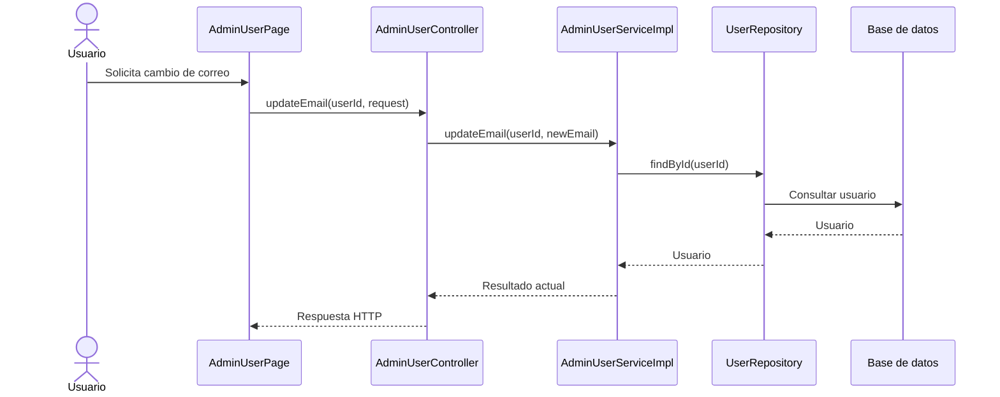
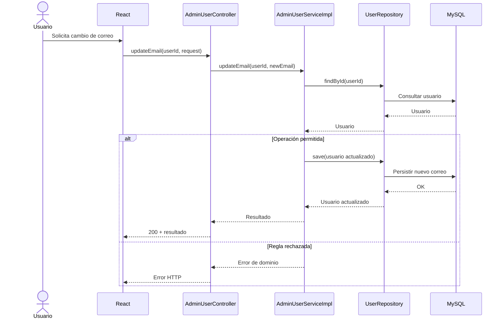

# Plantilla universal — Generar plan de implementación por tandas

Tomá como fuente principal el documento de propuesta/diseño indicado.

Tu objetivo es transformar esa propuesta en un **plan técnico de implementación por tandas pequeñas, ordenadas y revisables**, que sirva principalmente como **mapa de navegación y comprensión para el desarrollador**.

El plan debe permitir entender rápidamente:

1. cómo funciona actualmente el sistema;
2. cómo debería funcionar después;
3. en qué orden conviene implementar;
4. qué clases, archivos y métodos intervienen;
5. cómo circula cada flujo importante;
6. qué demuestra cada grupo de tests;
7. qué queda sin probar y qué riesgo permanece;
8. qué commit se sugiere para cerrar cada tanda.

**Priorizá claridad y capacidad de navegación sobre cantidad de documentación.**

No repitas en cada tanda reglas generales que puedan documentarse una sola vez.

---

# 1. Regla principal: la propuesta define el diseño

El documento de propuesta define las decisiones funcionales, de arquitectura, seguridad y negocio ya acordadas.

El plan de implementación debe convertir esas decisiones en trabajo técnico.

No inventes ni modifiques silenciosamente decisiones relevantes.

Si al inspeccionar el código descubrís que:

* falta una decisión;
* la propuesta contradice el código actual;
* aparece una dependencia no contemplada;
* implementar lo propuesto introduce un riesgo significativo;
* existen alternativas que cambiarían la arquitectura o el comportamiento acordado;

registralo como:

## DECISIÓN PENDIENTE — DXX

Indicá de forma breve:

* qué se descubrió;
* por qué importa;
* alternativas razonables;
* consecuencias principales;
* qué tanda queda bloqueada o condicionada.

No elijas automáticamente una alternativa arquitectónica relevante únicamente porque parezca conveniente.

Las decisiones menores de implementación que no cambien arquitectura, contrato, seguridad o comportamiento pueden resolverse durante la tanda.

---

# 2. Estado actual

Antes de dividir el trabajo, inspeccioná el código realmente relacionado con la propuesta.

Documentá únicamente lo necesario para comprender:

* flujo actual;
* componentes principales;
* persistencia involucrada;
* seguridad relevante;
* tests existentes relacionados;
* dependencias con otros flujos.

Separá claramente:

**COMPROBADO EN EL CÓDIGO ACTUAL**

de:

**COMPORTAMIENTO PROPUESTO**

No presentes comportamiento futuro como si ya estuviera implementado.

---

# 3. Mapa global antes y después

Cuando el cambio afecte un flujo relevante, incluir:

## Flujo actual

Utilizá preferentemente Mermaid `sequenceDiagram`.

Ejemplo:



El ejemplo es ilustrativo: reemplazarlo por las clases y los métodos comprobados en el código actual.

## Flujo objetivo

Mostrar cómo debería funcionar una vez terminadas todas las tandas.

Representar especialmente:

* entrada;
* controller;
* servicios;
* repositorios;
* persistencia;
* componentes externos;
* decisiones importantes;
* errores o caminos alternativos relevantes.

Desarrollar al menos un **camino feliz completo** de entrada a respuesta. En cada interacción principal, identificar la clase o componente concreto y el método que interviene, por ejemplo `AdminUserController.updateEmail(...)` → `AdminUserService.updateEmail(...)` → `UserRepository.save(...)`. Mostrar qué información pasa entre ellos y qué resultado devuelve cada etapa cuando sea importante para comprender el flujo. Si hay una interfaz y una implementación relevantes, indicar cuál expone el contrato y cuál ejecuta el comportamiento.

Usar nombres comprobados en el código para el flujo actual. Para el flujo objetivo, distinguir los métodos existentes de los **propuestos**; si la firma todavía no está decidida, usar un nombre tentativo marcado como tal. No presentar nombres inventados como código existente.

Agregar solo las bifurcaciones, validaciones y errores que cambien el recorrido o el resultado. No convertir el diagrama en una representación línea por línea del código ni enumerar métodos privados auxiliares.

El objetivo es que el desarrollador pueda entender **la película completa** antes de abrir las clases.

Si el cambio no tiene un flujo secuencial significativo, explicar brevemente por qué no se incluye diagrama.

---

# 4. Orden de implementación

Crear primero una tabla compacta:

| Tanda | Objetivo | Depende de | Estado      |
| ----- | -------- | ---------- | ----------- |
| 0     | ...      | ...        | Planificada |
| 1     | ...      | ...        | Planificada |

Debajo incluir un mapa simple:

```text
Tanda 0
   ↓
Tanda 1
   ↓
Tanda 2
   ├──→ Tanda 3
   └──→ Tanda 4
```

Explicar únicamente las dependencias que no sean evidentes.

Dividir el trabajo de forma que cada tanda:

* tenga un objetivo concreto;
* pueda comprenderse y revisarse antes de continuar;
* produzca un cambio coherente;
* pueda probarse;
* no adelante innecesariamente trabajo posterior.

No crear tandas artificialmente pequeñas ni agrupar cambios independientes solo para reducir su cantidad.

---

# 5. Formato de cada tanda

Usar el siguiente formato.

---

## Tanda N — Nombre

**Objetivo:** una explicación breve de qué deja resuelto esta tanda.

**Depende de:** tandas o decisiones necesarias.

### Mapa de código

Esta sección es obligatoria cuando la tanda modifica código.

Mostrar las clases/archivos principales siguiendo el flujo de ejecución cuando sea posible.

Ejemplo:

```text
[MODIFICADO] AdminUserController
src/main/java/.../AdminUserController.java
└── updateEmail(...)

        ↓

[MODIFICADO] AdminUserService
src/main/java/.../AdminUserService.java
└── updateEmail(...)

        ↓

[MODIFICADO] AdminUserServiceImpl
src/main/java/.../AdminUserServiceImpl.java
└── updateEmail(...)

        ├──→ ChallengeService.invalidateAll(...)
        ├──→ PasswordResetTokenRepository...
        └──→ AuthSessionService.revokeAllForUser(...)

        ↓

MySQL
```

Para cada elemento relevante indicar:

* clase o archivo;
* ruta;
* si es **NUEVO** o **MODIFICADO**;
* métodos principales que participan en el flujo, con sus nombres concretos;
* responsabilidad dentro de la tanda.

Seguir las llamadas principales desde la entrada hasta el resultado, incluyendo las funciones de controller, servicio, repositorio y otros componentes que efectivamente actúen. No desglosar los métodos privados internos de un servicio ni listar getters, setters, constructores triviales o métodos sin relación con el cambio. Si un método todavía no existe, marcarlo como **PROPUESTO**.

### Clases/archivos nuevos

Listar únicamente los previstos.

Formato recomendado:

```text
[NUEVO] UpdateUserEmailRequest
src/main/java/.../dto/UpdateUserEmailRequest.java

Responsabilidad:
Recibir exclusivamente el nuevo correo.

Usado por:
AdminUserController.updateEmail(...)
```

Si no se necesitan clases nuevas, indicarlo brevemente.

### Flujo de la tanda

Para flujos no triviales, incluir un Mermaid `sequenceDiagram` que detalle el camino feliz de esta tanda de principio a fin. Nombrar las clases participantes y rotular sus llamadas con los métodos principales concretos. Mostrar también los datos y resultados que explican por qué se pasa de un componente al siguiente.

Ejemplo:



El ejemplo es ilustrativo: reemplazar clases y métodos por los reales o marcar los propuestos. El diagrama debe mostrar **interacciones y decisiones**, sin descomponer cada servicio en sus llamadas privadas. Cuando un flujo atraviese varios servicios, incluir cada servicio y su método principal en el orden en que participa.

Para una tanda puramente estructural/documental donde Mermaid no aporte claridad, puede omitirse indicando el motivo.

### Cambios de persistencia/configuración

Solo cuando corresponda:

* tablas/campos;
* migraciones;
* índices;
* configuración;
* variables;
* contratos externos.

Omitir esta sección si no existe ningún cambio relevante.

### Tests necesarios

Incluir solamente las categorías aplicables.

Por ejemplo:

**Unitarios**

* `updateEmail_rejectsMfaEnabled`

    * demuestra que una cuenta con MFA activo no puede cambiar correo.

**Integración**

* cambio de correo + revocación de sesiones;

    * demuestra atomicidad entre identidad y credenciales.

**Seguridad**

* ADMIN recibe 403;

    * demuestra exclusividad de SUPER_ADMIN.

**Concurrencia**

* dos operaciones sobre el mismo recurso;

    * demuestra la regla de serialización/lock correspondiente.

**Regresión**

* login existente continúa funcionando;

    * demuestra que el cambio no rompió el flujo previo.

No escribir simplemente:

> agregar tests

o:

> ejecutar la suite.

Cada grupo debe explicar **qué comportamiento o riesgo demuestra**.

No es obligatorio incluir unitarios, integración, seguridad, concurrencia y regresión en todas las tandas.

### Qué NO queda probado

Declarar explícitamente los comportamientos o riesgos relevantes que esta tanda no demostrará.

Formato:

```text
NO PROBADO
- comportamiento X

RIESGO
- podría ocurrir Y

TRATAMIENTO
- cubrir ahora / cubrir en tanda posterior / aceptar temporalmente
```

No asumir que la ausencia de un test implica aceptación automática del riesgo.

### Commit sugerido

Proponer el commit que correspondería al cambio coherente de esta tanda, sin ejecutarlo durante la planificación:

* mensaje de commit concreto y breve, preferentemente con el estilo de commits del repositorio;
* alcance: código, tests, migraciones o documentación que deberían quedar juntos;
* si una tanda requiere más de un commit por contener pasos revisables independientes, sugerirlos en orden y explicar brevemente la separación.

No sugerir un commit que incluya trabajo de tandas posteriores ni cambios ajenos. Si la tanda no produce archivos versionables, indicar `Sin commit sugerido` y el motivo.

### Criterio de cierre

Checklist breve y verificable:

```text
[ ] flujo implementado
[ ] tests definidos para la tanda ejecutados
[ ] regresión relevante comprobada
[ ] tests faltantes declarados
[ ] incidentes registrados
[ ] riesgos residuales visibles
[ ] documentación actualizada
```

Adaptarlo a la tanda.

Que compile o que los tests ejecutados estén verdes no es suficiente por sí solo para cerrar una tanda.

### Resultado de ejecución

Inicialmente:

**PENDIENTE DE EJECUCIÓN**

No completar resultados ficticios durante la planificación.

Cuando posteriormente se ejecute la tanda, esta sección conservará resumidamente:

* cambios realizados;
* diferencias respecto del plan;
* tests ejecutados y resultado;
* incidentes;
* tests faltantes;
* riesgos residuales;
* decisiones nuevas;
* estado: `COMPLETA`, `PARCIAL` o `BLOQUEADA`.

No eliminar la planificación original.

---

# 6. Registro global de decisiones pendientes

No repetir la explicación completa de una decisión en todas las tandas.

Mantener una tabla central:

| ID  | Decisión | Alternativas | Bloquea |
| --- | -------- | ------------ | ------- |
| D01 | ...      | A / B        | Tanda 2 |
| D02 | ...      | A / B / C    | Tanda 5 |

Dentro de una tanda utilizar simplemente:

> Requiere D02.

Esto evita duplicación y mantiene visible dónde se toman decisiones.

---

# 7. Protocolo global de incidentes

No repetir este protocolo dentro de cada tanda.

Cuando posteriormente falle un test o aparezca un defecto relevante durante la implementación, registrar:

## INC-XXX — Nombre breve

**Tanda:**
N

**Contexto:**
Qué se estaba implementando o verificando.

**Test/comportamiento afectado:**
...

**Esperado:**
...

**Obtenido:**
...

**Clasificación:**

* defecto de implementación;
* defecto del test;
* cambio deliberado de contrato;
* configuración/infraestructura/entorno;
* problema de datos;
* causa todavía no determinada.

**Causa:**
Confirmada o hipótesis, indicando cuál de las dos.

**Resolución:**
Qué se modificó.

**Código productivo modificado:** sí/no
**Tests modificados:** sí/no
**Configuración/migraciones modificadas:** sí/no

**Resultado posterior:**
PASS / FAIL / PENDIENTE

**Riesgo o aprendizaje derivado:**
...

No modificar silenciosamente un test únicamente para conseguir que quede verde.

Si el comportamiento esperado sigue siendo correcto, corregir la implementación.

Si el contrato cambió pero ese cambio no está respaldado por la propuesta/plan, registrar una DECISIÓN PENDIENTE.

No registrar errores triviales de edición que no tengan impacto técnico.

---

# 8. Flujo acumulado

Al final del documento mantener:

## Flujo total acumulado

Durante la planificación mostrar el flujo objetivo completo.

Durante la implementación actualizarlo para distinguir:

* comportamiento actualmente implementado;
* comportamiento incorporado por la última tanda;
* pasos todavía futuros.

Puede utilizarse Mermaid o un diagrama de texto.

Ejemplo:

```text
IMPLEMENTADO
Login
   ↓
JWT con ID
   ↓
Validación de sesión
   ↓
Autorización administrativa

PENDIENTE
   ↓
Cambio de correo
   ↓
Baja lógica
   ↓
Reactivación
```

El objetivo es poder abrir el documento después de varias tandas y entender inmediatamente **hasta dónde llega realmente el sistema**.

---

# 9. Resumen final

Cerrar el plan con cuatro secciones breves:

## Orden de implementación

Resumen de las tandas y sus dependencias.

## Decisiones pendientes

Solo decisiones todavía no resueltas.

## Riesgos globales

Únicamente riesgos que atraviesen varias tandas.

## Validación final

Qué recorrido integral debería demostrarse cuando todas las tandas estén terminadas.

No repetir aquí el detalle de tests de cada tanda.

---

# 10. Restricciones durante la generación del plan

En esta etapa:

* NO implementar código;
* NO modificar tests;
* NO crear migraciones;
* NO cambiar configuración;
* NO crear commits;
* SÍ sugerir los commits de cada tanda, sin ejecutarlos;
* NO resolver silenciosamente decisiones arquitectónicas;
* NO comenzar ninguna tanda.

El resultado esperado es únicamente el plan.

---

# Criterio de calidad del documento

El plan debe poder utilizarse de dos maneras.

### Como mapa de estudio

El desarrollador debe poder responder rápidamente:

```text
¿Qué flujo estoy modificando?
        ↓
¿Por qué?
        ↓
¿Qué clases participan?
        ↓
¿Dónde están?
        ↓
¿Qué métodos intervienen?
        ↓
¿Cuál es el camino feliz entre esas clases y métodos?
        ↓
¿Cómo se comunican?
```

### Como mapa de ejecución

Debe permitir responder:

```text
¿Qué tanda toca?
        ↓
¿Qué depende de ella?
        ↓
¿Qué tengo que implementar?
        ↓
¿Qué tests demuestran que funciona?
        ↓
¿Qué no probé?
        ↓
¿Qué riesgo queda?
        ↓
¿Puedo aprobar la tanda?
        ↓
¿Qué commit agrupa su resultado?
```

Si un detalle no ayuda a responder alguna de estas preguntas, considerar resumirlo o eliminarlo.

**El objetivo no es producir el documento más extenso posible, sino el mapa técnico más útil posible.**
