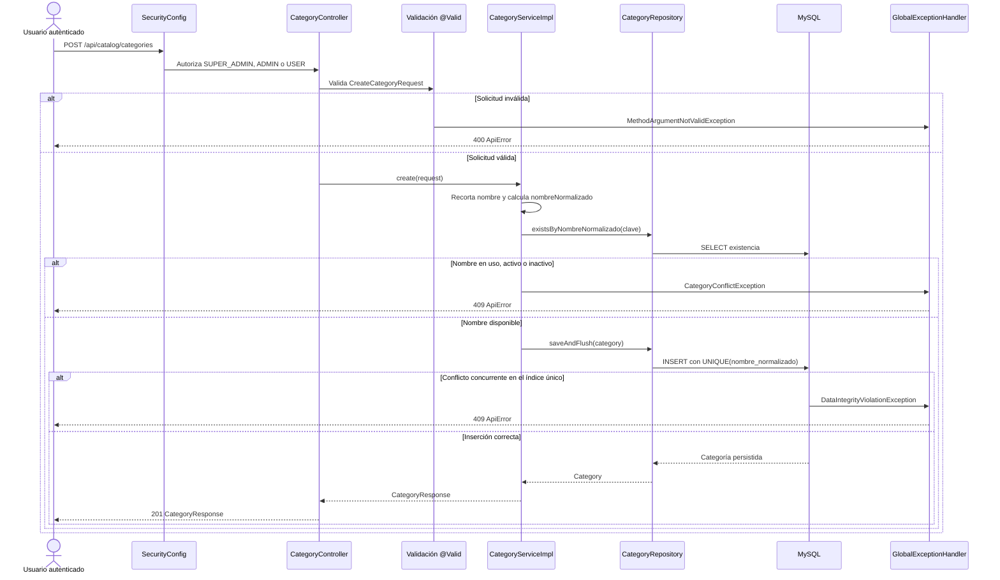
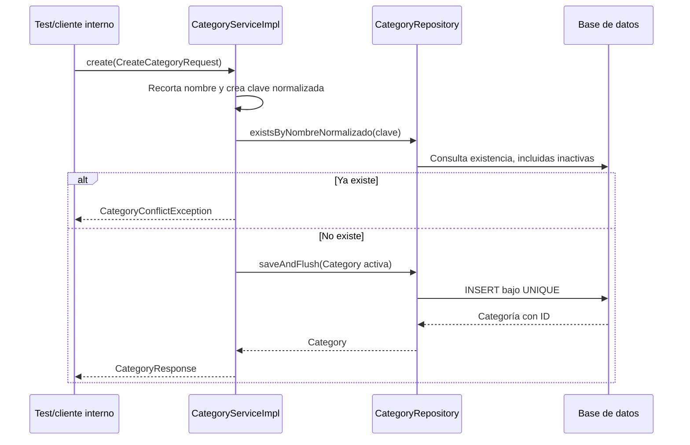

# S2 BE — Crear categoría: plan de implementación

**Estado:** tanda 1 completa; tandas 2 y 3 pendientes.

**Fuente funcional:** alcance acordado para la tarjeta S2 BE — Crear categoría y `docs/modelo-inicial.md`.

**Límite:** alta y listado privado de categorías. Cada producto tendrá una sola categoría en V1; productos y características se implementan en sus propias tarjetas.

## Estado actual — comprobado en el código

- El backend Spring Boot 4.1/Java 21 tiene Flyway V1–V4 para autenticación y usuarios. No existen tabla, entidad, controller, servicio ni repositorio de catálogo.
- `application.properties` configura MySQL y `spring.jpa.hibernate.ddl-auto=validate`; `application-test.properties` usa H2 en modo MySQL. Hay tests con Testcontainers/MySQL 8.4 para el esquema real.
- `SecurityConfig.filterChain(...)` permite `/api/public/**`, restringe `/api/admin/**` a `ADMIN`/`SUPER_ADMIN` y exige autenticación para las demás rutas. `@EnableMethodSecurity` permite reforzar los permisos en el controller. El prefijo `/api/admin/**` no sirve para esta tarjeta porque también debe acceder `USER`.
- `AdminUserController.create(...)` muestra el patrón existente: DTO con `@Valid`, servicio y respuesta 201. `GlobalExceptionHandler` ya convierte validación en 400 y `DataIntegrityViolationException` en 409 con el formato `ApiError`. Un conflicto de negocio de categoría necesita un tratamiento explícito 409, sin convertir errores de base de datos ajenos en “nombre duplicado”.
- `EntidadAuditable` aporta `created_at` y `updated_at`. Los tests actuales cubren HTTP con `MockMvc` y persistencia real con Testcontainers.

## Comportamiento propuesto

`POST /api/catalog/categories` recibe `nombre` e `icono` obligatorios y `descripcion` opcional. Recorta espacios exteriores del nombre; usa su versión en minúsculas para la comparación. Si ya hay una categoría activa o inactiva con ese nombre normalizado, devuelve 409. Si no la hay, crea una categoría activa y devuelve 201 con sus datos. La unicidad en MySQL es la garantía final ante solicitudes concurrentes.

`GET /api/catalog/categories` devuelve todas las categorías, incluidas las inactivas, ordenadas por nombre y luego por ID para estabilizar empates. Ambas rutas requieren sesión y admiten `SUPER_ADMIN`, `ADMIN` y `USER`. Esta tarjeta no añade lectura pública, detalle, edición, baja, imágenes, productos ni características.

### Flujo actual

No existe flujo secuencial de catálogo que diagramar: actualmente una petición a esas rutas no llega a un controller de categorías.

### Flujo objetivo completo

Los nombres de `CategoryController`, `CategoryServiceImpl`, `CategoryRepository` y sus métodos son **propuestos**. Los componentes de seguridad y errores ya existen.



Para el listado: `CategoryController.list()` → `CategoryServiceImpl.list()` → `CategoryRepository.findAllByOrderByNombreAscIdAsc()` → `List<CategoryResponse>` → HTTP 200. Una lista sin categorías es `[]` con 200.

## Orden de implementación

| Tanda | Objetivo | Depende de | Estado |
| --- | --- | --- | --- |
| 1 | Migración y persistencia de categoría | Ninguna | Completa |
| 2 | Servicio de alta y listado con regla de unicidad | Tanda 1 | Planificada |
| 3 | API, permisos, errores y recorrido HTTP completo | Tanda 2 | Planificada |

```text
Tanda 1 → Tanda 2 → Tanda 3
```

## Tanda 1 — Esquema y repositorio

**Objetivo:** disponer de la tabla de categorías, entidad JPA y consultas mínimas, con unicidad garantizada en la base.

**Depende de:** ninguna tanda anterior.

### Mapa de código

```text
[NUEVO] V5__create_categories.sql
Backend/spring-starter/src/main/resources/db/migration/
└── CREATE TABLE categories; UNIQUE(nombre_normalizado)
        ↓
[NUEVO] Category
Backend/spring-starter/src/main/java/com/ashenox/starter/catalog/category/model/Category.java
└── Mapea la tabla y hereda EntidadAuditable
        ↓
[NUEVO] CategoryRepository
Backend/spring-starter/src/main/java/com/ashenox/starter/catalog/category/repository/CategoryRepository.java
├── existsByNombreNormalizado(String)
└── findAllByOrderByNombreAscIdAsc()
```

### Clases/archivos nuevos

- `V5__create_categories.sql`: `id BIGINT` autoincremental, `nombre` y `nombre_normalizado` no nulos, `descripcion` nullable, `icono` no nulo, `activo` no nulo con valor inicial `true`, `created_at` y `updated_at` no nulos. Restricción `uk_categories_nombre_normalizado` sobre todas las filas; no crear índice aparte sobre la misma columna.
- `Category`: campos equivalentes al esquema; `nombreNormalizado` es interno y no se expone en la respuesta. `activo` inicia verdadero. No añadir relación JPA con productos todavía.
- `CategoryRepository extends JpaRepository<Category, Long>`: declaración de las dos consultas anteriores; `saveAndFlush(...)` se hereda.

### Flujo de la tanda

Esta tanda solo prepara persistencia, sin entrada HTTP ni camino de negocio completo. El recorrido verificable es Flyway → tabla MySQL → mapeo JPA → consultas del repositorio.

### Cambios de persistencia/configuración

- La migración V5 crea únicamente `categories`. Mantener nombres de columnas y tipos compatibles con `ddl-auto=validate` y la suite H2; comprobar la semántica de unicidad en MySQL, que es la base de producción.
- La clave se calcula en Java como `nombre.strip().toLowerCase(Locale.ROOT)` y se persiste junto al nombre visible. Solo se eliminan espacios exteriores y diferencias de mayúsculas; no aplicar eliminación de acentos, traducciones ni singularización. Usar la colación predeterminada de la base: si también considera iguales dos variantes con acentos, ambas se tratan como un nombre ocupado. El test MySQL es la autoridad para la unicidad real.
- Límites propuestos: `nombre` y `nombre_normalizado` hasta 160 caracteres; `icono` hasta 100; `descripcion` hasta 1000. Los mismos límites deben aparecer en SQL, entidad y DTO de la tanda 3.

### Tests necesarios

- **Integración H2:** arranque con V5 y `ddl-auto=validate`; demuestra que la entidad corresponde a la tabla y que el repositorio consulta nombres normalizados y ordena por nombre/ID.
- **Integración MySQL:** Flyway aplica V5, el índice existe, y dos inserciones con igual clave normalizada no pueden coexistir. Demuestra la garantía real de persistencia.

### Qué NO queda probado

```text
NO PROBADO
- Validación del request, autorización y respuestas HTTP.
RIESGO
- Sin el servicio, un caller puede intentar insertar datos inválidos.
TRATAMIENTO
- Cubrir en las tandas 2 y 3; no publicar esta tanda como función completa.
```

### Commit sugerido

`feat: add category persistence schema` — migración, entidad, repositorio y tests de esquema. No incluir archivos de usuario modificados previamente.

### Criterio de cierre

- [ ] Flyway V5 aplica en H2 y MySQL; Hibernate valida la entidad.
- [ ] El índice impide duplicados reales y el listado mantiene orden estable.
- [ ] Quedan registrados tests ejecutados, no probados, incidentes y riesgos residuales.

### Resultado de ejecución

**Estado:** COMPLETA (29/09/2026). Detalle en [tanda-1-resultado.md](tanda-1-resultado.md).

**Cambios realizados:** Flyway V5, entidad `Category`, `CategoryRepository`, test de persistencia H2 y comprobación del índice único en MySQL.

**Diferencias respecto del plan:** la comprobación MySQL se agregó a `MySqlSchemaIntegrationTests` existente, para reutilizar su contenedor y configuración. No se agregaron componentes de las tandas 2 o 3.

**Tests ejecutados:** `CategoryPersistenceIntegrationTest` (1), `MySqlSchemaIntegrationTests` (2), `SpringStarterApplicationTests` (1) y `UserPersistenceIntegrationTests` (1).

**Tests exitosos:** 5; H2 y MySQL aplicaron V5, Hibernate validó el mapeo, el repositorio consultó y ordenó, MySQL rechazó el duplicado, y el arranque/persistencia de usuarios siguieron funcionando.

**Tests fallidos:** ninguno tras resolver el incidente de entorno `INC-001`.

**Incidentes:** `INC-001`: falta de `JAVA_HOME` y bloqueo de red del sandbox en los primeros intentos de Maven. Se ejecutó con JDK 21 instalado y acceso autorizado a dependencias; BUILD SUCCESS.

**Tests faltantes:** ninguno de los previstos para la tanda 1. La carrera de dos solicitudes y las respuestas HTTP pertenecen a las tandas 2 y 3.

**Riesgos residuales:** la colación de MySQL puede ampliar qué nombres considera iguales; no existe aún servicio que calcule `nombre_normalizado` ni API para categorías, por diseño de tandas.

**Decisiones pendientes descubiertas:** ninguna.

**Archivos modificados:** `V5__create_categories.sql`, `Category.java`, `CategoryRepository.java`, `CategoryPersistenceIntegrationTest.java` y `MySqlSchemaIntegrationTests.java`; este plan y `tanda-1-resultado.md` registran la ejecución.

## Tanda 2 — Lógica de negocio

**Objetivo:** crear y listar categorías con la regla de nombre único, sin exponer todavía rutas HTTP.

**Depende de:** tanda 1.

### Mapa de código

```text
[NUEVO] CategoryService
Backend/spring-starter/src/main/java/com/ashenox/starter/catalog/category/service/CategoryService.java
├── create(CreateCategoryRequest): CategoryResponse
└── list(): List<CategoryResponse>
        ↓
[NUEVO] CategoryServiceImpl
Backend/spring-starter/src/main/java/com/ashenox/starter/catalog/category/service/CategoryServiceImpl.java
├── create(...): normalizar → comprobar existencia → saveAndFlush → mapear
└── list(): consulta ordenada → mapear
        ↓
[EXISTENTE DESDE TANDA 1] CategoryRepository
└── existsByNombreNormalizado(...), saveAndFlush(...), findAllByOrderByNombreAscIdAsc()
        ↓
MySQL
```

### Clases/archivos nuevos

- `CategoryService` y `CategoryServiceImpl`: contrato e implementación; `create(...)` transaccional y `list()` de solo lectura. No introducir servicios base o capas genéricas.
- `CategoryConflictException`: excepción específica para el nombre ya ocupado; el handler HTTP se incorpora en la tanda 3.
- `CreateCategoryRequest` y `CategoryResponse`: records del paquete `catalog/category/dto`, compartidos por servicio y futura API. El response contiene `id`, `nombre`, `descripcion`, `icono` y `activo`; no devuelve `nombreNormalizado`.

### Flujo de la tanda



`list()` usa la consulta ordenada del repositorio y mapea todas las filas a respuestas, incluidas las inactivas.

### Tests necesarios

- **Unitarios de servicio:** crea con nombre recortado y clave en minúsculas; `activo=true`; descripción opcional; detecta categoría activa o inactiva duplicada antes del `saveAndFlush`; lista vacía y orden recibido del repositorio. Demuestran las decisiones de negocio, sin repetir los detalles del framework.
- **Integración MySQL:** dos altas simultáneas del mismo nombre dejan una fila. La segunda falla por restricción única y luego la API debe traducirla a 409 en tanda 3. Demuestra que el `exists` por sí solo no es la garantía de concurrencia.

### Qué NO queda probado

```text
NO PROBADO
- Traducción de excepciones a HTTP ni permisos de los tres roles.
RIESGO
- El servicio funciona, pero la función no está disponible por API.
TRATAMIENTO
- Cubrir en la tanda 3.
```

### Commit sugerido

`feat: add category creation service` — DTOs, servicio, excepción y tests de negocio.

### Criterio de cierre

- [ ] Alta y listado funcionan desde el servicio; activo e inactivo cuentan como duplicado.
- [ ] Concurrencia en MySQL conserva una sola fila.
- [ ] Quedan registrados tests ejecutados, no probados, incidentes y riesgos residuales.

### Resultado de ejecución

**PENDIENTE DE EJECUCIÓN**

## Tanda 3 — API, permisos y errores

**Objetivo:** exponer el alta y listado privados con los códigos HTTP acordados.

**Depende de:** tanda 2.

### Mapa de código

```text
[NUEVO] CategoryController
Backend/spring-starter/src/main/java/com/ashenox/starter/catalog/category/controller/CategoryController.java
├── create(@Valid @RequestBody CreateCategoryRequest): 201 CategoryResponse
└── list(): 200 List<CategoryResponse>
        ↓
[NUEVO] CategoryService / CategoryServiceImpl
├── create(...)
└── list()
        ↓
CategoryRepository → MySQL

[MODIFICADO] GlobalExceptionHandler
Backend/spring-starter/src/main/java/com/ashenox/starter/shared/error/GlobalExceptionHandler.java
└── handleCategoryConflict(...): 409 ApiError
```

### Clases/archivos nuevos

- `CategoryController`, con base `/api/catalog/categories` y `@PreAuthorize("hasAnyRole('SUPER_ADMIN','ADMIN','USER')")`. Al estar fuera de `/api/admin/**`, la regla existente `anyRequest().authenticated()` permite a `USER` llegar al controller. No cambiar `SecurityConfig` salvo que un test demuestre un bloqueo concreto.
- `CreateCategoryRequest` de la tanda 2 recibe en esta tanda las anotaciones Bean Validation: `@NotBlank` y `@Size` para nombre e ícono; `@Size` para descripción cuando se informe. `CategoryResponse` es la respuesta de ambas rutas.

### Flujo de la tanda

El diagrama de **flujo objetivo completo** de arriba es el recorrido de esta tanda: filtro de seguridad → controller/validación → servicio → repositorio/MySQL → respuesta o `GlobalExceptionHandler`.

### Cambios de persistencia/configuración

- Agregar un handler de `CategoryConflictException` que devuelva `ApiErrorCode.RESOURCE_CONFLICT` y 409. Mantener el handler existente de `DataIntegrityViolationException` como 409 genérico para carreras del índice único. No capturar cualquier `DataIntegrityViolationException` dentro del servicio como si fuera siempre un nombre repetido.
- Respuestas: POST 201 con body, GET 200 con arreglo (incluso vacío); 400 para datos inválidos, 401 sin sesión, 403 para acceso prohibido y 409 para nombre ya usado. Mantener el CSRF existente para POST: una sesión válida sin token CSRF recibe 403.

### Tests necesarios

- **HTTP/validación:** POST válido devuelve 201 y la categoría aparece en GET; nombre o ícono en blanco/superior al límite devuelve 400; descripción ausente se acepta; JSON malformado devuelve 400; lista vacía devuelve `[]`.
- **HTTP/conflicto:** variantes de mayúsculas y espacios devuelven 409, incluida una categoría inactiva. Verificar `ApiError.status`, `code` y `requestId`; un choque del índice en MySQL también devuelve 409 y nunca 500.
- **Seguridad:** `SUPER_ADMIN`, `ADMIN` y `USER` pueden usar GET y POST con sesión válida; anónimo recibe 401; POST sin CSRF recibe 403. No hay un cuarto rol definido en el modelo actual, por lo que el 403 de permiso se verifica mediante la regla de método o una identidad sin rol autorizado, sin inventar un rol de negocio.
- **Regresión:** tests existentes de autenticación y administración de usuarios pasan; la nueva ruta no altera la protección de `/api/admin/users`.

### Qué NO queda probado

```text
NO PROBADO
- Edición/desactivación, consulta pública y uso de categorías por productos.
RIESGO
- Esos flujos aún no existen; no deben simularse en esta tarjeta.
TRATAMIENTO
- Cubrir en las tarjetas de edición, producto y catálogo público.
```

### Commit sugerido

`feat: expose private category creation and listing` — controller, validaciones, handler y tests HTTP/seguridad.

### Criterio de cierre

- [ ] Camino feliz POST → MySQL → GET demostrado con 201/200.
- [ ] Validación, conflicto, autenticación y CSRF devuelven el código acordado.
- [ ] La prueba de carrera MySQL termina en una sola fila y respuestas 201/409.
- [ ] Se ejecutan regresiones relevantes y se registran faltantes, incidentes y riesgos.

### Resultado de ejecución

**PENDIENTE DE EJECUCIÓN**

## Decisiones pendientes

No hay decisiones que bloqueen esta tarjeta. Quedan fijadas para tarjetas posteriores: un producto pertenece a una categoría y su nombre es único dentro de ella; el nombre de una característica es único globalmente, y un producto puede tener varios valores distintos sin repetir la misma combinación de clave, valor y unidad. Al planificar Sprint 3 se debe ajustar `docs/modelo-inicial.md`, que hoy contempla la posibilidad de un solo valor por clave y producto.

## Protocolo global de incidentes

Si un test o flujo falla durante la ejecución, registrar una entrada `INC-XXX` con tanda, comportamiento esperado/obtenido, clasificación (código, test, contrato, entorno o datos), causa confirmada o hipótesis, resolución, archivos afectados y resultado posterior. No cambiar un test solo para dejarlo verde: una diferencia de contrato requiere una decisión explícita.

## Flujo total acumulado

```text
IMPLEMENTADO HOY
Autenticación + sesiones + CSRF + formato global de errores + Flyway V1–V5
Category + CategoryRepository + restricción UNIQUE en categories

PENDIENTE EN ESTA TARJETA
Sesión autorizada → CategoryController.create/list
                   → CategoryServiceImpl.create/list
                   → CategoryRepository → categories (Flyway V5)
                   → CategoryResponse / ApiError

POSTERIOR
Editar/desactivar categoría → Crear producto con una categoría
                            → Características e imágenes → Catálogo público
```

## Resumen final

### Orden de implementación

1. Persistencia y restricción única.
2. Servicio de creación y listado.
3. API, permisos y respuestas de error.

### Decisiones pendientes

Ninguna para esta tarjeta.

### Riesgos globales

- La colación de MySQL puede considerar iguales variantes con acentos; la API responderá 409 por la restricción única. No se promete permitir esas variantes como categorías distintas.
- Los tests H2 verifican mapeo y flujo rápido; la garantía de concurrencia y el índice se aceptan solo con MySQL.

### Validación final

Con sesiones de los tres roles, crear una categoría, verla en el listado, rechazar una variante duplicada con 409 y comprobar en MySQL que dos altas simultáneas producen una sola fila. Registrar los tests efectivamente ejecutados, los omitidos y el motivo antes de mover la tarjeta a validación.
