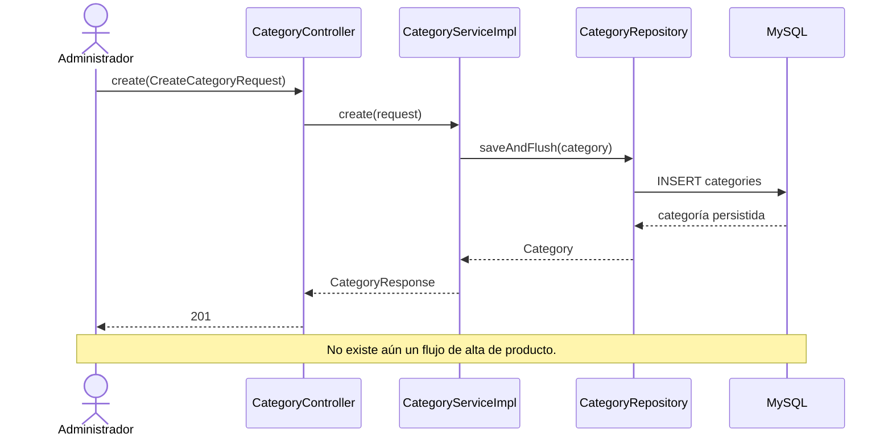
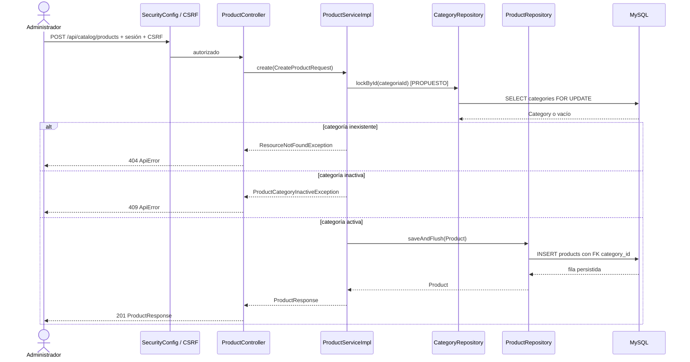

# S2 BE — Crear producto básico: plan de implementación

**Fuentes de diseño:** `docs/modelo-inicial.md`, `docs/trello-backlog.md`, `docs/Diagrama ECOMMERCE.drawio` y las decisiones acordadas para esta tarjeta. El diagrama muestra el modelo objetivo posterior a Sprint 3; este plan crea el producto básico de Sprint 2.

**Alcance:** migración Flyway, entidad y repositorio `Product`, servicio de alta y `POST /api/catalog/products` privado. No incluye edición, listados, ficha pública, características, variantes, imágenes, promociones ni formulario React. La elegibilidad de categorías inactivas y la conservación de productos existentes al desactivar una categoría se verifican aquí porque quedaron pendientes de la tarjeta de edición de categoría.

## Estado actual — comprobado en el código

- Flyway llega hasta `V5__create_categories.sql`: `categories` tiene `activo`, fechas de auditoría y nombre normalizado único. No existe tabla, entidad, repositorio, servicio ni ruta de producto.
- `CategoryController` expone alta, listado y cambios de estado; `CategoryServiceImpl` persiste con `CategoryRepository`. Una categoría inactiva permanece en la base y en el listado administrativo.
- `CategoryServiceImpl.setActive(...)` lee con `findById(...)` y todavía no coordina un cambio de estado con altas de productos concurrentes. Otros módulos ya usan bloqueos pesimistas de filas con JPA/MySQL.
- `SecurityConfig` exige `SUPER_ADMIN`, `ADMIN` o `USER` para `/api/catalog/categories/**`, pero no tiene una regla explícita para `/api/catalog/products/**`. Las mutaciones requieren sesión y CSRF.
- `GlobalExceptionHandler` y `ApiErrorResponder` unifican los errores 400, 404 y 409 en `ApiError` con `status`, `code` y `requestId`. `ResourceNotFoundException` ya sirve para categoría inexistente.
- Las pruebas de categorías usan H2 con Flyway y validación del mapeo JPA; las pruebas MySQL usan Testcontainers. La tarjeta anterior dejó pendiente comprobar el rechazo de categorías inactivas y que su desactivación conserve productos asociados.

### Flujo actual



## Comportamiento propuesto y contrato

`POST /api/catalog/products` recibe JSON con `nombre`, `categoriaId`, `descripcion` opcional, `precioReferencia` y `disponible`. Devuelve `201` y `ProductResponse` con `id`, esos cinco campos, `activo=true` y `destacado=false`. `activo` y `destacado` no forman parte del request; el servicio fija ambos valores. No se aceptan características ni variantes en esta tarjeta.

| Campo | Regla de alta |
| --- | --- |
| `nombre` | Obligatorio, no solo espacios, máximo 160 caracteres; se persiste sin espacios exteriores. Los nombres repetidos se permiten, incluso en la misma categoría. |
| `categoriaId` | Obligatorio y positivo. Si no existe: 404 `RESOURCE_NOT_FOUND`; si existe inactiva: 409 `RESOURCE_CONFLICT`. |
| `descripcion` | Opcional, máximo 1000 caracteres. |
| `precioReferencia` | Obligatorio, mayor que cero, hasta 13 dígitos enteros y 2 decimales. No redondear un valor con más de 2 decimales. Es orientativo, no precio vinculante. |
| `disponible` | Booleano obligatorio. No representa stock cuantificado. |

Las entradas inválidas devuelven 400 `VALIDATION_ERROR` (o `MALFORMED_REQUEST` si el JSON no puede leerse). La API requiere sesión válida, CSRF y uno de los tres roles admitidos; otros roles reciben 403. No se agrega unicidad al nombre de producto. El alta no publica por sí misma un endpoint de lectura pública; eso corresponde a Sprint 4.

**Garantía concurrente acordada:** `ProductServiceImpl.create(...)` y `CategoryServiceImpl.setActive(...)` bloquean la misma fila de categoría con `PESSIMISTIC_WRITE` dentro de sus transacciones. Si el alta obtiene el bloqueo primero, termina antes de la desactivación y el producto queda conservado en la categoría luego inactiva. Si la desactivación termina primero, el alta lee el estado inactivo y devuelve 409. También se usa el bloqueo al reactivar para mantener el mismo orden de transiciones. No se bloquean todas las categorías ni el catálogo completo.

En Sprint 2, `products.precio_referencia` y `products.disponible` son datos del producto. La tarjeta `S3 BE Variantes de producto` creará una variante inicial por cada producto existente y trasladará esos valores a las variantes. No crear tablas de variantes ahora.

### Flujo objetivo completo

Los métodos de producto y `ProductCategoryInactiveException` siguientes son **propuestos**; los de categoría, seguridad y errores nombrados ya existen.



## Orden de implementación

| Tanda | Objetivo | Depende de | Estado |
| --- | --- | --- | --- |
| 1 | Tabla, mapeo y repositorio | `categories` V5 | Planificada |
| 2 | Servicio de alta y reglas de negocio | Tanda 1 | Completa |
| 3 | Ruta privada, errores y pruebas HTTP | Tanda 2 | Planificada |

```text
Tanda 1 → Tanda 2 → Tanda 3
```

## Tanda 1 — Persistencia del producto básico

**Objetivo:** crear una fila de producto ligada a una categoría sin incorporar variantes ni comportamiento HTTP.

**Depende de:** V5 y la tabla `categories` existentes.

### Mapa de código

```text
[NUEVO] V6__create_products.sql
src/main/resources/db/migration/V6__create_products.sql
└── CREATE TABLE products; FK e índice por category_id

        ↓

[NUEVO] Product
src/main/java/com/ashenox/starter/catalog/product/model/Product.java
└── entidad JPA; @ManyToOne(fetch = LAZY) hacia Category; hereda EntidadAuditable

        ↓

[NUEVO] ProductRepository
src/main/java/com/ashenox/starter/catalog/product/repository/ProductRepository.java
└── JpaRepository<Product, Long>; saveAndFlush(...) heredado

        ↓

MySQL / H2 de test
```

### Clases/archivos nuevos

Los tres indicados en el mapa y `ProductPersistenceIntegrationTest` para verificar migración y mapeo.

### Flujo de la tanda

No se incluye secuencia HTTP: la tanda solo guarda y recarga una entidad mediante `ProductRepository.saveAndFlush(...)` y `findById(...)`.

### Cambios de persistencia/configuración

`products`: `id BIGINT` autoincremental; `category_id BIGINT NOT NULL` con FK a `categories(id)` e índice; `nombre VARCHAR(160) NOT NULL`; `descripcion VARCHAR(1000) NULL`; `precio_referencia DECIMAL(15,2) NOT NULL` con restricción `> 0`; `disponible BOOLEAN NOT NULL`; `activo BOOLEAN NOT NULL DEFAULT TRUE`; `destacado BOOLEAN NOT NULL DEFAULT FALSE`; `created_at` y `updated_at DATETIME(6) NOT NULL`. No se define índice único sobre `nombre`. La FK debe impedir dejar productos huérfanos si se intentara borrar una categoría; la baja de categoría existente sigue siendo lógica.

### Tests necesarios

- **Integración H2/Flyway:** aplicar V6, guardar y recargar producto con categoría, precio decimal exacto, disponibilidad y auditoría; demuestra compatibilidad entre esquema y JPA.
- **Integración MySQL/Testcontainers:** comprobar FK, precisión decimal y restricción de precio positivo en el motor de producción; demuestra que H2 no oculta diferencias de DDL.

### Qué NO queda probado

```text
NO PROBADO: validación del request y rechazo de categoría inactiva.
RIESGO: la persistencia existe, pero todavía podría usarse sin reglas de negocio.
TRATAMIENTO: servicio y pruebas de la tanda 2; no exponer la ruta antes de la tanda 3.
```

### Commit sugerido

`feat: add basic product persistence` — V6, entidad, repositorio y pruebas de persistencia.

### Criterio de cierre

- [ ] Flyway y mapeo JPA validan en H2 y MySQL.
- [ ] FK, precio y auditoría comprobados; faltantes e incidentes registrados.
- [ ] Documentación de la tanda actualizada con resultados reales.

### Resultado de ejecución

**Estado:** COMPLETA

**Cambios realizados:** V6 crea `products` con FK e índice por categoría, precio `DECIMAL(15,2)` positivo y auditoría. `Product` mapea la categoría con carga diferida, los campos básicos y los estados iniciales; `ProductRepository` extiende `JpaRepository`. Se agregaron pruebas H2 y MySQL de persistencia.

**Diferencias respecto del plan:** ninguna funcional. Las pruebas Maven se ejecutaron en un contenedor temporal con Java 21 porque el equipo no tenía `JAVA_HOME` configurado.

**Tests ejecutados:** `ProductPersistenceIntegrationTest` (1), `ProductPersistenceMySqlTest` (3) y regresión `CategoryPersistenceIntegrationTest` (3), con Flyway y `ddl-auto=validate` en H2 y MySQL 8.4.

**Tests exitosos:** 7/7 en la ejecución final. H2 guardó y recargó categoría, precio exacto, disponibilidad, estados y auditoría. MySQL comprobó precio exacto, auditoría, rechazo de FK inválida y precio no positivo, y protección ante borrado de categoría referenciada. La regresión de persistencia de categorías pasó.

**Tests fallidos:** ninguno en la ejecución final. En la primera ejecución falló una aserción de `ProductPersistenceMySqlTest` sobre el tipo de excepción Spring; el motor sí rechazó el precio cero.

**Incidentes:** `INC-T1-001` (expectativa incorrecta del test sobre la traducción de la violación `CHECK`) y `INC-T1-002` (JDK local ausente, resuelto con contenedor temporal). Detalle en `s2-be-crear-producto-basico-tanda-1-resultado.md`.

**Tests faltantes:** ninguno de los planificados para esta tanda.

**Riesgos residuales:** todavía no existe servicio que exija categoría activa ni validación de request; son parte de la tanda 2. No hay ruta HTTP, que corresponde a la tanda 3.

**Decisiones pendientes descubiertas:** ninguna.

**Archivos modificados:** `V6__create_products.sql`, `Product.java`, `ProductRepository.java`, `ProductPersistenceIntegrationTest.java`, `ProductPersistenceMySqlTest.java`, este plan y `s2-be-crear-producto-basico-tanda-1-resultado.md`.

## Tanda 2 — Servicio y elegibilidad de categoría

**Objetivo:** crear el producto con reglas explícitas y sin permitir una categoría inactiva.

**Depende de:** tanda 1.

### Mapa de código

```text
[NUEVOS] CreateProductRequest / ProductResponse
src/main/java/com/ashenox/starter/catalog/product/dto/
└── contrato de entrada validable y salida; ProductResponse.from(Product) propuesto

        ↓

[NUEVOS] ProductService / ProductServiceImpl
src/main/java/com/ashenox/starter/catalog/product/service/
└── create(CreateProductRequest) propuesto; transacción de alta con bloqueo de categoría

        ├──→ [MODIFICADO] CategoryRepository.lockById(categoriaId) [PROPUESTO]
        └──→ [NUEVO] ProductRepository.saveAndFlush(product)

[MODIFICADO] CategoryServiceImpl
src/main/java/com/ashenox/starter/catalog/category/service/CategoryServiceImpl.java
└── setActive(id, active) existente; pasa a usar CategoryRepository.lockById(id)

[NUEVA] ProductCategoryInactiveException
src/main/java/com/ashenox/starter/catalog/product/service/
└── señala el conflicto de estado para el adaptador HTTP de la tanda 3
```

### Clases/archivos nuevos

`CreateProductRequest`, `ProductResponse`, `ProductService`, `ProductServiceImpl`, `ProductCategoryInactiveException`, `ProductServiceTest` y `ProductCategoryConcurrencyMySqlTest`. Modificar `CategoryRepository` para añadir `lockById(Long)` mediante `@Lock(PESSIMISTIC_WRITE)` y consulta JPQL por ID; modificar `CategoryServiceImpl.setActive(...)` para usarla. Ajustar `CategoryServiceTest` a esa llamada sin cambiar el contrato HTTP de categorías.

### Flujo de la tanda

```mermaid
sequenceDiagram
    participant Test as ProductServiceTest
    participant S as ProductServiceImpl
    participant CR as CategoryRepository
    participant PR as ProductRepository
    Test->>S: create(request)
    S->>CR: lockById(categoriaId)
    alt categoría activa
        CR-->>S: Category
        S->>PR: saveAndFlush(Product con activo=true, destacado=false)
        PR-->>S: Product con ID
        S-->>Test: ProductResponse
    else inexistente o inactiva
        CR-->>S: vacío o Category inactiva
        S-->>Test: excepción; no llama a saveAndFlush
    end
```

### Tests necesarios

- **Unitarios:** nombre sin espacios exteriores, datos conservados, `activo=true`, `destacado=false` y nombres duplicados admitidos; demuestra el mapeo y los valores fijados por el servidor.
- **Unitarios:** categoría inexistente o inactiva no guarda producto; demuestra la elegibilidad y la ausencia de escritura parcial.
- **Integración H2:** crear producto en categoría activa, desactivar la categoría mediante `CategoryService.deactivate(...)`, comprobar que el producto conserva `category_id`, `activo` y demás datos; verificar que otra alta en esa categoría se rechaza y vuelve a ser posible tras reactivarla. Cierra la aceptación pendiente de la tarjeta de categoría.
- **Concurrencia MySQL/Testcontainers:** forzar ambos órdenes con dos transacciones: alta obtiene el bloqueo primero → se guarda y luego se desactiva conservando el producto; desactivación obtiene el bloqueo primero → el alta espera y lanza `ProductCategoryInactiveException` sin insertar (mapeada a 409 en la tanda 3). Demuestra que el control de estado se serializa en MySQL. Repetir las pruebas de servicio de categoría tras cambiar su lectura a `lockById`.

### Qué NO queda probado

```text
NO PROBADO: códigos HTTP, permisos y CSRF.
RIESGO: el servicio correcto aún no estaría protegido como endpoint.
TRATAMIENTO: tanda 3.
```

### Commit sugerido

`feat: add basic product creation service` — DTO, servicio, bloqueo coordinado con estado de categoría y pruebas de lógica/concurrencia.

### Criterio de cierre

- [ ] Reglas de categoría activa y valores iniciales comprobados.
- [ ] Ambos órdenes de alta/desactivación comprobados en MySQL.
- [ ] Producto existente sobrevive a desactivar y reactivar su categoría.
- [ ] Faltantes, incidentes y resultados reales registrados.

### Resultado de ejecución

**Estado:** COMPLETA

**Cambios realizados:** se añadieron `CreateProductRequest` con restricciones de entrada, `ProductResponse`, `ProductService`, `ProductServiceImpl` y `ProductCategoryInactiveException`. El alta bloquea la categoría, exige que esté activa, recorta el nombre y fija `activo=true` y `destacado=false` antes de guardar. `CategoryRepository.lockById` usa `PESSIMISTIC_WRITE`; desactivación y reactivación usan ese mismo bloqueo. Se añadieron pruebas unitarias, H2 y de los dos órdenes concurrentes en MySQL.

**Diferencias respecto del plan:** ninguna funcional. Java 21 y Maven se ejecutaron en un contenedor temporal por ausencia de JDK local.

**Tests ejecutados:** `ProductServiceTest` (4), `ProductServiceIntegrationTest` (1), `ProductCategoryConcurrencyMySqlTest` (2), `CategoryServiceTest` (8), `CategoryPersistenceIntegrationTest` (3), `CategoryControllerTest` (7), `CategoryServiceMySqlTest` (2), `ProductPersistenceIntegrationTest` (1) y `ProductPersistenceMySqlTest` (3).

**Tests exitosos:** 31/31 en las ejecuciones finales, sin omisiones. MySQL observó esperas reales de bloqueo en ambos órdenes y verificó el resultado luego del commit. H2 comprobó conservación y reactivación; la regresión de categoría y persistencia pasó.

**Tests fallidos:** ninguno en las ejecuciones finales. La primera ejecución omitió los tests MySQL al no detectar el socket Docker dentro del contenedor Maven; se repitió con el socket correcto.

**Incidentes:** `INC-T2-001`, montaje inicial del socket Docker; resolución y evidencia en `s2-be-crear-producto-basico-tanda-2-resultado.md`.

**Tests faltantes:** ninguno de los planificados para esta tanda.

**Riesgos residuales:** aún no se verifican respuestas HTTP, permisos ni CSRF del alta de producto; corresponden a la tanda 3. Las restricciones del DTO todavía no se ejercitan por HTTP.

**Decisiones pendientes descubiertas:** ninguna.

**Archivos modificados:** `CreateProductRequest.java`, `ProductResponse.java`, `ProductService.java`, `ProductServiceImpl.java`, `ProductCategoryInactiveException.java`, `CategoryRepository.java`, `CategoryServiceImpl.java`, `ProductServiceTest.java`, `ProductServiceIntegrationTest.java`, `ProductCategoryConcurrencyMySqlTest.java`, `CategoryServiceTest.java`, este plan y `s2-be-crear-producto-basico-tanda-2-resultado.md`.

## Tanda 3 — API privada y errores

**Objetivo:** exponer el alta validada con el mismo contrato de seguridad y errores que las categorías.

**Depende de:** tanda 2.

### Mapa de código

```text
[MODIFICADO] SecurityConfig
src/main/java/com/ashenox/starter/security/config/SecurityConfig.java
└── matcher explícito para /api/catalog/products y /** con los tres roles

        ↓

[NUEVO] ProductController
src/main/java/com/ashenox/starter/catalog/product/controller/ProductController.java
└── create(@Valid @RequestBody CreateProductRequest): ResponseEntity<ProductResponse> (propuesto)

        ↓

[NUEVO] ProductService.create(...) → [MODIFICADO] CategoryRepository.lockById(...)
                                 → [NUEVO] ProductRepository.saveAndFlush(...)

[MODIFICADO] GlobalExceptionHandler
src/main/java/com/ashenox/starter/shared/error/GlobalExceptionHandler.java
└── ProductCategoryInactiveException → 409 RESOURCE_CONFLICT
```

### Clases/archivos nuevos

`ProductController` y `ProductControllerTest`; el resto indicado se modifica o proviene de tandas anteriores.

### Flujo de la tanda

El flujo HTTP feliz y los dos rechazos de categoría son los del diagrama objetivo. `ProductController.create(...)` devuelve 201 con `ProductResponse`; `GlobalExceptionHandler` conserva el formato `ApiError` para 400/404/409.

### Cambios de persistencia/configuración

Regla explícita en `SecurityConfig` para `/api/catalog/products` y subrutas, además de `@PreAuthorize` en `ProductController`, igual que en categorías. Mantener CSRF global. No añadir rutas públicas ni configuración nueva.

### Tests necesarios

- **HTTP y seguridad:** `SUPER_ADMIN`, `ADMIN` y `USER` crean con sesión y CSRF; falta de sesión, CSRF o rol admitido devuelve 401/403 según corresponda, sin insertar filas.
- **HTTP de contrato:** 201 devuelve ID, `categoriaId`, valores persistidos y estados iniciales; un request que incluya `activo=false` o `destacado=true` no cambia los valores fijados por el servidor.
- **HTTP de validación:** nombre vacío/largo, categoría ausente o no positiva, precio nulo/cero/negativo/con más de dos decimales o demasiados dígitos, disponibilidad ausente, descripción larga y JSON malformado; devuelve 400 y `ApiError` coherente.
- **HTTP de negocio:** categoría inexistente → 404; inactiva → 409; ninguna crea producto. Comprobar `status`, `code` y `requestId`.
- **Regresión:** las rutas de categoría siguen admitiendo los tres roles y sus cambios de estado siguen funcionando.

### Qué NO queda probado

```text
NO PROBADO: ficha pública, edición, variantes, imágenes ni precio por variante.
RIESGO: el producto solo puede darse de alta y aún no puede administrarse o mostrarse completo.
TRATAMIENTO: tarjetas de edición/listados de Sprint 2 y de variantes/catálogo público de Sprint 3/4.
```

### Commit sugerido

`feat: expose private basic product creation` — controller, matcher, handler y pruebas HTTP.

### Criterio de cierre

- [ ] Alta HTTP y respuestas 400/401/403/404/409 verificadas.
- [ ] Prueba de conservación de producto al desactivar categoría repetida por el recorrido integrado.
- [ ] Regresión de categorías, faltantes e incidentes registrados.

### Resultado de ejecución

**PENDIENTE DE EJECUCIÓN**

## Registro global de decisiones pendientes

Ninguna bloquea este plan. Las decisiones de contrato acordadas figuran al inicio; variantes y precio público ya tienen tarjetas posteriores. Si durante la ejecución aparece una alternativa que cambie arquitectura, contrato, seguridad o negocio, registrar `DECISIÓN PENDIENTE — DXX` con alternativas, consecuencias y tanda afectada antes de elegirla.

## Protocolo global de incidentes

Ante un fallo relevante, registrar `INC-XXX` con tanda, contexto, esperado/obtenido, clasificación (implementación, test, contrato, entorno, datos o causa indeterminada), causa confirmada o hipótesis, resolución, archivos productivos/tests/configuración afectados, resultado posterior y riesgo residual. No cambiar un test solo para dejarlo verde sin respaldar el cambio de contrato.

## Flujo total acumulado

```text
IMPLEMENTADO HOY
Sesión + CSRF → CategoryController → CategoryServiceImpl → CategoryRepository → categories V5

PLANIFICADO
                ↓
Tanda 1: products V6 + Product + ProductRepository
                ↓
Tanda 2: ProductServiceImpl.create → CategoryRepository.lockById → ProductRepository.saveAndFlush
         CategoryServiceImpl.setActive → CategoryRepository.lockById
                ↓
Tanda 3: SecurityConfig → ProductController.create → 201 ProductResponse / ApiError

POSTERIOR
Editar/listar productos → Variantes Sprint 3 → Catálogo público Sprint 4
```

## Resumen final

### Orden de implementación

Persistencia → servicio y elegibilidad de categoría → API privada, seguridad y contrato HTTP.

### Decisiones pendientes

Ninguna para iniciar las tres tandas.

### Riesgos globales

La compatibilidad real del DDL, la precisión decimal y el orden concurrente de alta/desactivación requieren MySQL/Testcontainers; H2 no los sustituye. Las migraciones de Sprint 3 deberán conservar precios y disponibilidad ya cargados al crear la variante inicial.

### Validación final

Con sesiones de los tres roles, crear un producto en categoría activa y verificar sus datos y estados iniciales; rechazar datos inválidos, categoría ausente e inactiva con los códigos acordados; desactivar y reactivar la categoría sin perder el producto; comprobar ambos órdenes concurrentes en MySQL; aplicar Flyway y el mapeo en H2 y MySQL. Registrar los tests ejecutados, los omitidos y sus motivos antes de cerrar la tarjeta.
