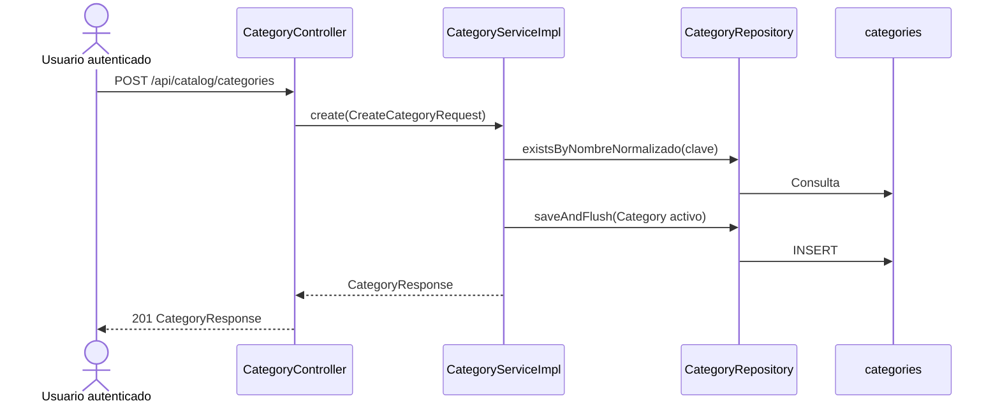
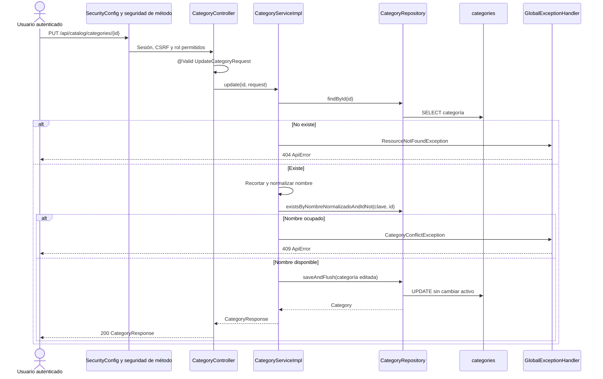

# S2 BE — Editar, desactivar o reactivar categoría

**Fuentes de diseño:** [tarjeta de Trello](https://trello.com/c/71BFTaBn), `docs/modelo-inicial.md` y la decisión acordada de implementar la restricción de categorías inactivas al crear productos en la tarjeta **S2 BE Crear producto**.

## Estado al planificar — comprobado en el código

- `Category` y Flyway V5 ya persisten `activo`; `nombre_normalizado` es único entre categorías activas e inactivas. No se necesita migración.
- `CategoryController` ofrece `POST` y `GET /api/catalog/categories`. La anotación de clase admite los tres roles; `SecurityConfig` exige autenticación para esta ruta, pero aún no enumera allí los roles.
- `CategoryServiceImpl.create(...)` recorta y normaliza el nombre, comprueba duplicados y crea la categoría activa. `list()` incluye las inactivas.
- `GlobalExceptionHandler` ya traduce validación a 400, recurso inexistente a 404 y conflicto a 409. Hay tests de servicio, HTTP y persistencia MySQL. Todavía no existe `Product`.

## Comportamiento propuesto

- `PUT /api/catalog/categories/{id}` recibe **nombre, descripción e ícono completos**, aplica las validaciones del alta y devuelve `200 CategoryResponse`. La edición conserva el valor de `activo`.
- `POST /api/catalog/categories/{id}/deactivate` y `/reactivate` devuelven `200 CategoryResponse`. Repetir una transición ya aplicada devuelve el estado actual sin error.
- Las transiciones solo modifican `Category.activo`: no borran la fila, sus relaciones ni el estado de los productos existentes.
- Las tres rutas requieren sesión, CSRF y rol `SUPER_ADMIN`, `ADMIN` o `USER`. ID inexistente devuelve 404; datos inválidos, 400; nombre ocupado por otra categoría, 409.
- La lectura administrativa por ID sigue perteneciendo a la tarjeta de listados. La validación de categoría activa al crear un producto pertenece a **S2 BE Crear producto**.

### Flujo actual



El listado actual recorre `CategoryController.list()` → `CategoryServiceImpl.list()` → `CategoryRepository.findAllByOrderByNombreAscIdAsc()`.

### Flujo objetivo

Los métodos `update`, `deactivate` y `reactivate` son **propuestos**.



Las dos rutas de estado siguen la misma entrada y búsqueda por ID; `CategoryServiceImpl.deactivate(...)` o `reactivate(...)` fija `activo`, persiste el cambio y devuelve `CategoryResponse`.

## Orden de implementación

| Tanda | Objetivo | Depende de | Estado |
| --- | --- | --- | --- |
| 1 | Edición y unicidad en servicio | Categoría existente | Completa |
| 2 | Desactivación y reactivación en servicio | Tanda 1 | Planificada |
| 3 | Rutas HTTP, seguridad y regresión integral | Tandas 1 y 2 | Planificada |

```text
Tanda 1 → Tanda 2 → Tanda 3
```

## Tanda 1 — Edición de categoría

**Objetivo:** editar los tres datos visibles sin modificar el estado y sin permitir nombres duplicados.

**Depende de:** implementación actual de categoría.

### Mapa de código

```text
[NUEVO] UpdateCategoryRequest
Backend/spring-starter/src/main/java/com/ashenox/starter/catalog/category/dto/UpdateCategoryRequest.java
└── Datos completos y validación equivalente al alta
        ↓
[MODIFICADO] CategoryService / CategoryServiceImpl
Backend/spring-starter/src/main/java/com/ashenox/starter/catalog/category/service/
└── update(id, request) [PROPUESTO]
        ↓
[MODIFICADO] CategoryRepository
Backend/spring-starter/src/main/java/com/ashenox/starter/catalog/category/repository/CategoryRepository.java
├── findById(id) [EXISTENTE, heredado]
├── existsByNombreNormalizadoAndIdNot(clave, id) [PROPUESTO]
└── saveAndFlush(category) [EXISTENTE, heredado]
        ↓
categories
```

### Clases/archivos nuevos

`UpdateCategoryRequest`: nombre e ícono obligatorios con los límites actuales; descripción opcional con límite de 1000 caracteres. No incluye `activo`.

### Flujo de la tanda

`CategoryServiceImpl.update(...)` busca la categoría, normaliza el nombre recibido, verifica que ninguna **otra** categoría use esa clave, actualiza los datos y persiste. Si el ID no existe, lanza `ResourceNotFoundException`; si el nombre está ocupado, `CategoryConflictException`. El índice único existente protege la carrera entre solicitudes.

### Tests necesarios

- **Servicio:** editar el nombre actual sin falso conflicto; cambiarlo a uno libre; rechazar el de otra categoría activa o inactiva; conservar `activo`.
- **Persistencia:** comprobar que nombre visible y normalizado se guardan juntos y que el índice existente impide dos nombres iguales.

### Qué NO queda probado

```text
NO PROBADO: contrato HTTP, CSRF y roles.
RIESGO: el servicio funciona sin una ruta accesible.
TRATAMIENTO: cubrir en la tanda 3.
```

### Commit sugerido

`feat: add category editing service` — DTO, servicio, consulta de repositorio y tests de la tanda.

### Criterio de cierre

- [ ] Edición y conflictos comprobados.
- [ ] Estado `activo` conservado.
- [ ] Tests ejecutados y riesgos registrados.

### Resultado de ejecución

**Estado:** COMPLETA (29/09/2026). Detalle en [tanda-1-resultado.md](tanda-1-resultado.md).

**Cambios realizados:** `UpdateCategoryRequest`, `CategoryService.update(...)`, consulta de unicidad que excluye el ID actual y pruebas de servicio/persistencia. La edición conserva `activo`.

**Diferencias respecto del plan:** ninguna funcional; se amplió el test MySQL existente para comprobar que el índice único también rechaza un `UPDATE` duplicado.

**Tests ejecutados:** 16 pruebas en `CategoryServiceTest` (6), `CategoryPersistenceIntegrationTest` (2), `MySqlSchemaIntegrationTests` (2), `CategoryControllerTest` (4) y `CategoryServiceMySqlTest` (2).

**Tests exitosos:** 16/16. Servicio, persistencia H2/MySQL y regresión del alta/listado existentes.

**Tests fallidos:** ninguno de los tests ejecutados. Los intentos iniciales de Maven en sandbox no llegaron a iniciar las pruebas por bloqueo de red; ver `INC-001`.

**Incidentes:** `INC-001`, resolución de dependencias Maven bloqueada en sandbox; las pruebas se ejecutaron con acceso autorizado y JDK 21.

**Tests faltantes:** contrato HTTP, validación `@Valid`, CSRF y roles para edición (tanda 3); concurrencia de dos ediciones al mismo nombre, cuya protección se apoya en el índice MySQL comprobado.

**Riesgos residuales:** el método de edición todavía no está expuesto por HTTP. Un conflicto concurrente de edición dependerá del índice único y del 409 genérico existente.

**Decisiones pendientes descubiertas:** ninguna.

**Archivos modificados:** DTO nuevo, `CategoryService`, `CategoryServiceImpl`, `CategoryRepository`, tres clases de test, este plan y `tanda-1-resultado.md`. El cambio previo en `docs/trello-backlog.md` permanece ajeno a esta tanda.

## Tanda 2 — Baja lógica y reactivación

**Objetivo:** cambiar el estado de una categoría sin borrar datos.

**Depende de:** tanda 1.

### Mapa de código

```text
[MODIFICADO] CategoryService / CategoryServiceImpl
Backend/spring-starter/src/main/java/com/ashenox/starter/catalog/category/service/
├── deactivate(id) [PROPUESTO]
└── reactivate(id) [PROPUESTO]
        ↓
[EXISTENTE] CategoryRepository
Backend/spring-starter/src/main/java/com/ashenox/starter/catalog/category/repository/CategoryRepository.java
├── findById(id)
└── saveAndFlush(category)
        ↓
categories.activo
```

### Clases/archivos nuevos

Ninguno.

### Flujo de la tanda

Buscar por ID; responder 404 si no existe; fijar `activo=false` o `activo=true`; devolver la categoría resultante. Una categoría que ya está en el estado solicitado conserva ese estado y devuelve una respuesta correcta.

### Tests necesarios

- **Servicio e integración:** desactivar y reactivar persisten; repetir ambas acciones no falla; el listado sigue incluyendo la categoría; no disminuye el número de filas.
- **Regresión:** nombre y demás campos permanecen iguales al cambiar el estado.

### Qué NO queda probado

```text
NO PROBADO: conservación de relaciones y estado de productos.
RIESGO: Product aún no existe; no es posible demostrar esa aceptación de extremo a extremo.
TRATAMIENTO: probarla al implementar Product y su relación con Category.
```

### Commit sugerido

`feat: add category status transitions` — servicio y tests de estado.

### Criterio de cierre

- [ ] Ambas transiciones y su repetición comprobadas.
- [ ] No hay borrado físico ni cambios en otros campos.
- [ ] Dependencia de productos registrada.

### Resultado de ejecución

**PENDIENTE DE EJECUCIÓN**

## Tanda 3 — API y autorización

**Objetivo:** exponer los tres cambios mediante HTTP con los permisos y errores acordados.

**Depende de:** tandas 1 y 2.

### Mapa de código

```text
[MODIFICADO] SecurityConfig
Backend/spring-starter/src/main/java/com/ashenox/starter/security/config/SecurityConfig.java
└── matcher para /api/catalog/categories y /**
        ↓
[MODIFICADO] CategoryController
Backend/spring-starter/src/main/java/com/ashenox/starter/catalog/category/controller/CategoryController.java
├── update(id, request) [PROPUESTO]
├── deactivate(id) [PROPUESTO]
└── reactivate(id) [PROPUESTO]
        ↓
[MODIFICADO] CategoryService / CategoryServiceImpl
        ↓
[EXISTENTE] CategoryRepository → categories
```

### Clases/archivos nuevos

Ninguno. Se reutilizan `CategoryResponse`, `CategoryConflictException`, `ResourceNotFoundException` y los handlers existentes.

### Flujo de la tanda

El diagrama de **flujo objetivo** muestra el recorrido completo de la edición. Las rutas de estado usan el mismo filtro, controller, servicio, repositorio y formato de respuesta. Agregar el matcher explícito en `SecurityConfig` antes de `anyRequest().authenticated()` y conservar `@PreAuthorize` en el controller.

### Cambios de configuración

Solo la regla de autorización. No hay migración ni variables nuevas. `PUT` y `POST` mantienen la protección CSRF existente.

### Tests necesarios

- **HTTP:** `PUT` válido devuelve 200 y datos persistidos; las dos acciones de estado devuelven 200 y el valor de `activo` correcto; ID inexistente devuelve 404; validación, 400; nombre duplicado, 409 con `ApiError`.
- **Seguridad:** los tres roles acceden; anónimo recibe 401; petición de escritura sin CSRF recibe 403; una identidad de test sin rol permitido recibe 403.
- **Regresión:** alta y listado de categorías siguen funcionando; la regla nueva no amplía permisos de `/api/admin/users`.

### Qué NO queda probado

```text
NO PROBADO: alta de producto con categoría inactiva y estado de productos ya relacionados.
RIESGO: el criterio completo de la tarjeta depende de código que todavía no existe.
TRATAMIENTO: cubrir en S2 BE Crear producto y repetir la prueba de conservación al existir Product.
```

### Commit sugerido

`feat: expose category edit and status endpoints` — controller, `SecurityConfig` y tests HTTP/seguridad.

### Criterio de cierre

- [ ] Tres rutas responden con contrato y errores acordados.
- [ ] Roles, anonimato y CSRF comprobados.
- [ ] Regresión de categorías y administración ejecutada.
- [ ] Dependencia de productos permanece visible para la aceptación final.

### Resultado de ejecución

**PENDIENTE DE EJECUCIÓN**

## Decisiones pendientes

Ninguna para iniciar estas tandas. La consulta por ID queda en la tarjeta de listados; la elegibilidad de categorías al crear productos se implementa en **S2 BE Crear producto**. La indicación más reciente de la tarjeta de Trello exige la regla explícita en `SecurityConfig`, además de la anotación existente.

## Protocolo global de incidentes

Durante la ejecución, registrar como `INC-XXX` cualquier fallo relevante con tanda, esperado/obtenido, clasificación, causa confirmada o hipótesis, resolución, archivos afectados y resultado posterior. No modificar un test solo para dejarlo verde; un cambio de contrato requiere decisión explícita.

## Flujo total acumulado

```text
IMPLEMENTADO HOY
Sesión + CSRF → CategoryController.create/list
              → CategoryServiceImpl.create/list
              → CategoryRepository → categories
CategoryServiceImpl.update → CategoryRepository → categories
  (servicio implementado en tanda 1; todavía sin ruta HTTP)

PENDIENTE EN ESTA TARJETA
CategoryServiceImpl.deactivate/reactivate (tanda 2)
Sesión + CSRF + rol → CategoryController.update/deactivate/reactivate (tanda 3)
                    → CategoryServiceImpl.update/deactivate/reactivate
                    → CategoryRepository → categories
                    → CategoryResponse / ApiError

POSTERIOR
Crear producto → comprobar Category.activo
Producto existente → conservar relación y estado al desactivar su categoría
```

## Resumen final

### Orden de implementación

Edición de servicio → transiciones de estado → API y seguridad.

### Decisiones pendientes

Ninguna para estas tandas.

### Riesgos globales

La aceptación relacionada con productos requiere el módulo `Product`. La unicidad ante concurrencia depende del índice MySQL existente; un conflicto de integridad se comunica como 409 genérico.

### Validación final

Con cada rol permitido, editar, desactivar y reactivar una categoría; comprobar 400/401/403/404/409, persistencia y ausencia de borrado físico. Cuando exista `Product`, verificar que los productos asociados siguen activos y que solo una categoría activa puede asignarse a productos nuevos.
